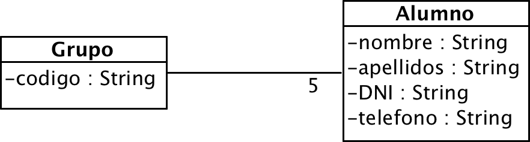

# Ejercicio 4 - Grupo y alumnos

Añade la clase grupo al proyecto [anterior](../03_alumno/). 

En este caso, desde el programa principal crearemos un grupo y de él colgaremos 5 alumnos, tal como indica la asociación.

