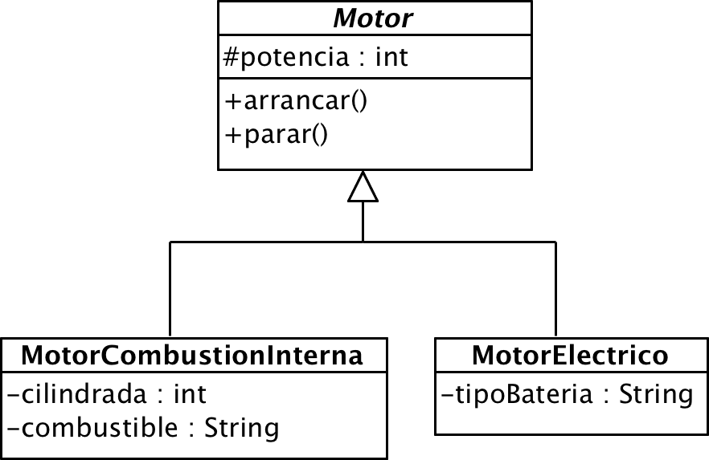

# Ejercicio 6 - Híbrido

El departamento de ingeniería ha perfeccionado nuestros sistemas de propulsión añadiendo motores eléctricos para mejorar la eficiencia, creando coches híbridos. 

Modifica el [proyecto anterior](../05_coche/) y añade las nuevas clases.
