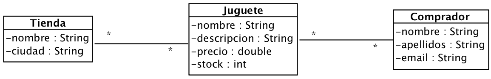

# Ejercicio 3 - Juguetería

Queremos construir la aplicación de gestión de almacén y ventas de una juguetería. Para ello, programaremos una aplicación en Java siguiendo el diagrama de clases siguiente:

El programa mostrará un menú como el siguiente:

1. Gestión de tiendas
	1. Nueva tienda 
	2. Baja de tienda 
2. Gestión de juguetes
	1. Nuevo juguete (asociado a una tienda)
	2. Modificar stock de un juguete
3. Gestión de compras
	1. Nuevo comprador 
	2. Baja de comprador 
	3. Realizar compra (asociar comprador y juguete)
4. Consultas
	1. Mostrar todas las compras de un comprador concreto
	2. Mostrar los productos de una tienda con stock menor que 5 unidades
	3. Mostrar los juguetes comprados en una tienda, incluyendo datos del comprador 
5. Salir

El funcionamiento del sistema es el siguiente:

- Un juguete está asociado a una tienda concreta, por lo que si dos tiendas tienen el mismo juguete, aparecerán dos copias en nuestra aplicación.
- Si se elimina una tienda, se eliminarán todos los juguetes asociados a ella, pero no los compradores.
- Al realizar una compra, el programa tiene en cuenta el stock del juguete que se compra, de modo que no se realice la compra si no hay suficiente.

Restricciones: 

- Todas las estructuras de datos estarán basadas en el interface `List<E>` del JCF.
- El programa principal mantendrá listas con referencias a todos los objetos del sistema.
