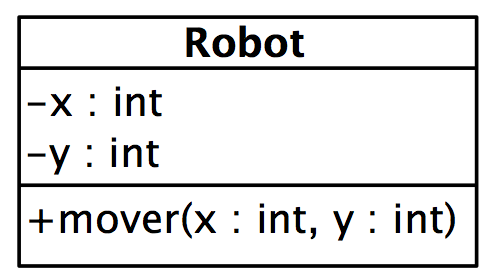

# Ejercicio 1 - Robot

Queremos simular el movimiento de un pequeño robot llamado *Robbie*, usando la clase  Robot que tenemos que implementar:

El robot tiene algunas peculiaridades:

- El movimiento siempre comienza en las coordenadas (0,0) de un tablero imaginario.
- Sólo es capaz de moverse en intervalos de 1 metro, a izquierda, derecha, arriba o abajo. Si le pedimos que se mueva a más distancia, o en diagonal, no nos hará caso.
- Cuando el movimiento solicitado sea correcto, mostrará en pantalla las coordenadas de su nueva situación.
