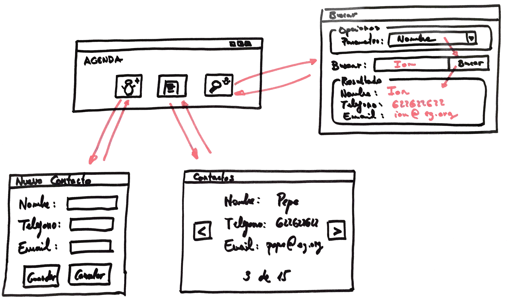

# Ejercicio 4 - Agenda

Tenemos que implementar una aplicación para mantener una agenda de contactos básica, siguiendo las directrices de este *mockup*:

Las aplicación tiene tres componentes:

- Nuevo contacto: permite crear una nueva entrada en la lista de contactos.
- Listado: Muestra, de uno en uno, todos los contactos y nos permite desplazarnos de uno a otro, indicando en todo momento en cual estamos.
- Búsqueda: Nos permite seleccionar por cual de los tres campos (nombre, teléfono o email) vamos a buscar y realiza la búsqueda en la lista de contactos, mostrando el primero que coincida con el criterio, si existe.
